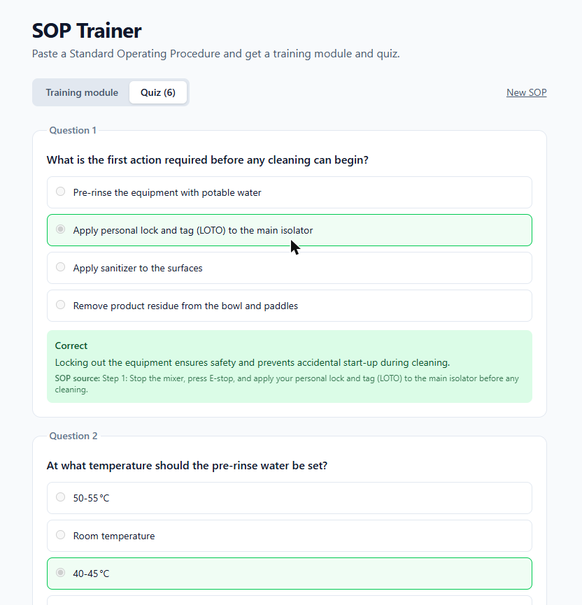
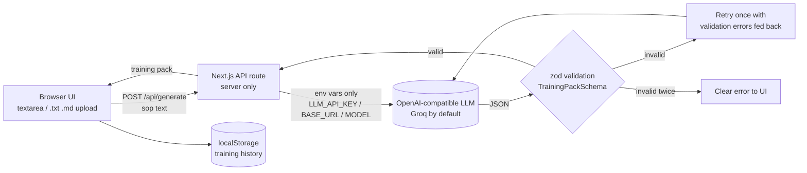

# SOP Trainer

Paste (or upload) a manufacturing Standard Operating Procedure and get a short **training module** and a **quiz** in seconds.

- **Training module**: 3-sentence summary, numbered key steps, safety warnings, common mistakes.
- **Quiz**: 5–8 multiple-choice questions. Every question cites the SOP step it comes from (`sourceStep`) and has a short explanation.
- **Feedback**: score plus per-question feedback that points back to the SOP step. Attempts are saved in `localStorage` and shown as a small training history.
- Two built-in sample SOPs (*Mixer cleaning and sanitation*, *Raw material weighing*) for instant demos.
- No auth, no database. The API key stays on the server.

## Architecture

Key files: `src/lib/schemas.ts` (zod schemas), `src/lib/generate.ts` (prompt + validate + retry), `src/app/api/generate/route.ts` (server route), `tests/generate.test.ts`.

## Setup

1. **Clone** – `git clone https://github.com/johnsinapsis/sop-trainer.git && cd sop-trainer && npm install`
2. **Configure** – `cp .env.example .env.local`, then put a free [Groq API key](https://console.groq.com/keys) in `LLM_API_KEY`.
3. **Run** – `npm run dev` and open <http://localhost:3000>.

If the key is missing the UI shows these setup instructions.

### Scripts

| Command | What it does |
| --- | --- |
| `npm run dev` | Dev server |
| `npm run build` / `npm start` | Production build / server |
| `npm run lint` | ESLint |
| `npm run typecheck` | `tsc --noEmit` |
| `npm test` | Vitest (mocked LLM, no network or key needed) |

## Switching providers

Any OpenAI-compatible API works; only environment variables change (in `.env.local`):

| Provider | `LLM_BASE_URL` | Example `LLM_MODEL` |
| --- | --- | --- |
| Groq (default) | `https://api.groq.com/openai/v1` | `openai/gpt-oss-120b` |
| OpenAI | `https://api.openai.com/v1` | `gpt-4o-mini` |
| OpenRouter | `https://openrouter.ai/api/v1` | `meta-llama/llama-3.3-70b-instruct` |
| Ollama (local) | `http://localhost:11434/v1` | `llama3.1` (set any non-empty `LLM_API_KEY`) |

The provider must support `response_format: { type: "json_object" }`; the prompt also asks for JSON only and code fences are tolerated.

## AI output validation

The model's reply is parsed and checked against zod schemas (`summary` = 2–4 sentences (the prompt asks for 3; the count is approximate and ignores abbreviations like "e.g."), ≥3 key steps, 5–8 quiz questions with 4 options, a valid `correctIndex`, and a non-empty `sourceStep` + `explanation` on every question). On invalid JSON or a schema failure, the request is retried **once** with the exact validation errors fed back to the model. If it still fails, the API returns a clear error (HTTP 502) and the UI displays it with details.

## How I built it

This project was built with [Claude Code](https://claude.com/claude-code) and then reviewed and tested by me: I read through the generated code, ran lint/typecheck/tests, and exercised the app myself.
